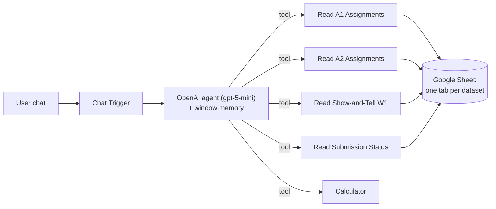

# CIS 515 Workflow Analyst

An AI agent, built in n8n, that lets an instructor ask plain-English questions about an entire graduate class's n8n workflow submissions and get grounded, cited answers back. Built as the teaching assistant for a 106-student graduate course (CIS 515) at ASU's W. P. Carey School of Business.

This repository is a **sanitized, non-confidential artifact**: it contains the workflow's architecture and agent design only. All student data lived in a private Google Sheet, never in this workflow, and the Sheet ID, n8n host, and instructor name have been replaced with placeholders. See [Data and privacy](#data-and-privacy).

## Problem

A 106-student cohort produced 700+ n8n workflows across seven assignments, plus weekly Yellowdig show-and-tell posts. The instructor needed to understand the class at a glance (common patterns, standout builds, week-over-week evolution, who had not submitted) without manually opening 100+ submissions every week.

## What it does

Ask it questions like:

- "How did builds evolve from Assignment 1 to Assignment 2?"
- "What are the most common, most complex, and most unique patterns?"
- "What did a given student build in A1 and A2?"
- "Who has not submitted A1 or A2?"
- "List the Week-1 Yellowdig show-and-tells."

Every answer is read live from the class data, cites the student and the assignment or week, and the agent says so when something is not in the data (for example, Week 2 and Week 3 show-and-tells that were not loaded yet).

## Architecture

A companion **Data Loader** workflow rebuilds each Sheet tab from canonical CSVs, and a **Summary PDF** workflow generates downloadable PDF summaries. Only the Analyst is included here (the Data Loader embeds class data and is intentionally omitted).

## Key design decision: grounded, not hardcoded

The agent hardcodes **no** class data in its prompt. Every fact comes from a tool call against the live Google Sheet, with a separate read tool per dataset (A1, A2, Show-and-Tell W1, Submission Status) plus a calculator for counts. This keeps answers current when the data changes, forces the model to cite its source, and prevents it from inventing students, titles, or numbers. The system prompt (included in the workflow JSON) enforces "read the relevant tab before answering, cite the student and assignment, and say so when it is not in the data."

## Tech stack

- **n8n** (LangChain agent nodes): Chat Trigger, Agent, OpenAI chat model, buffer-window memory, Google Sheets tools, Calculator
- **Model:** OpenAI `gpt-5-mini`
- **Data layer:** Google Sheets (one tab per dataset)

## What I owned

I proposed and built the whole system end to end:

- A local Python pipeline that extracted 300+ workflows from student write-ups (.docx / .pdf) and n8n JSON exports, and auto-rendered a diagram when only JSON was submitted.
- The data model and tagging scheme (9 workflow pattern types, a 1 to 5 complexity score).
- All three n8n workflows: this Analyst agent, the Data Loader, and the Summary PDF generator.
- The deliverables (a tracker spreadsheet and a written class summary) and the handoff runbooks so the instructor now runs the system on his own n8n instance.

## Outcomes

- Processed 748 workflow submissions across seven assignments (A1–A7) from a 106-student roster, and pattern-tagged and complexity-scored the first five (535 workflows: A1 106, A2 106, A3 105, A4 112, A5 106) plus 197 Yellowdig show-and-tell posts across five weeks.
- Surfaced defensible, class-wide findings, for example self-evaluation and reflection loops jumping from 3 builds to 57 in a single week, and average build complexity climbing from 1.92 at Assignment 1 to a 2.62 peak at Assignment 4 (on a 1-5 scale).
- Verified end to end with successful live runs and delivered as a self-serve tool the instructor operates independently.

## Run it yourself

1. In n8n: **Workflows -> Import from File** and select `workflows/CIS515_Workflow_Analyst.json`.
2. Open the OpenAI node and select your own OpenAI credential.
3. Open each Google Sheets tool node and select your own Google Sheets credential.
4. Replace `YOUR_GOOGLE_SHEET_ID` with your own Sheet ID, with tabs named `A1_Assignments`, `A2_Assignments`, `ShowAndTell_W1`, and `Submission_Status`.
5. Activate the workflow and open the chat.

## Data and privacy

This artifact contains no student data. The class data lived only in a private Google Sheet, which is not shared here. Placeholders replace the original Google Sheet ID (`YOUR_GOOGLE_SHEET_ID`), the n8n host (`YOUR_N8N_HOST`), and the instructor's name. The credential values themselves are never part of an n8n export.
